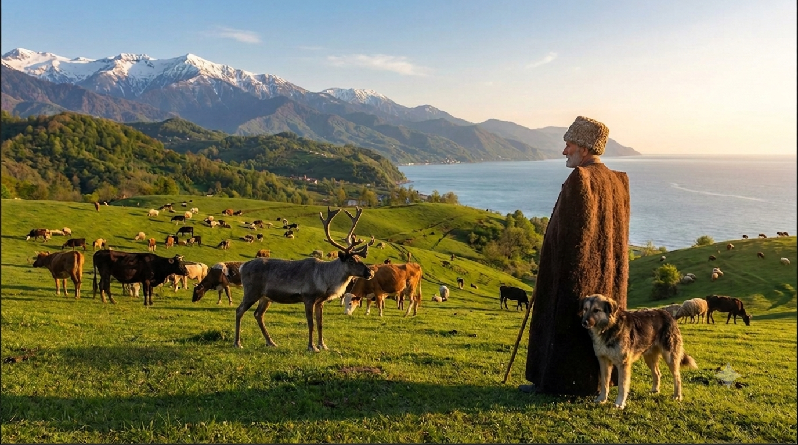
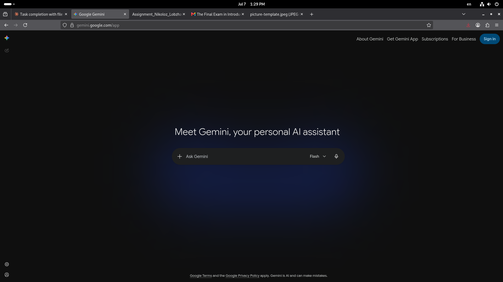
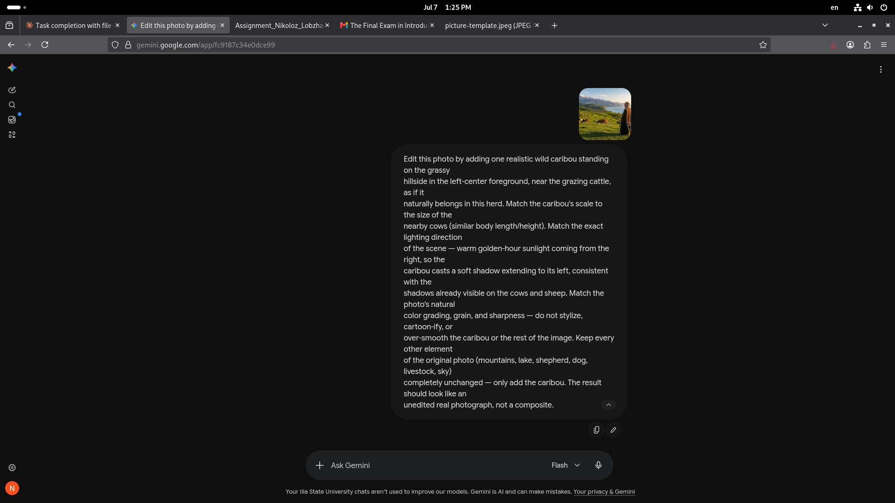
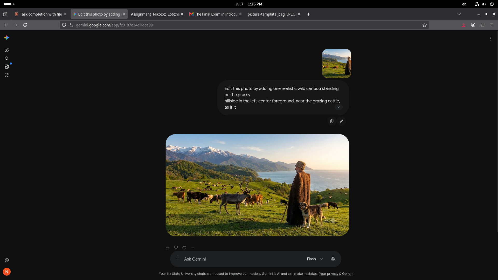
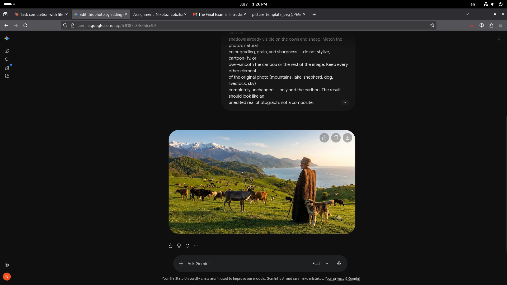
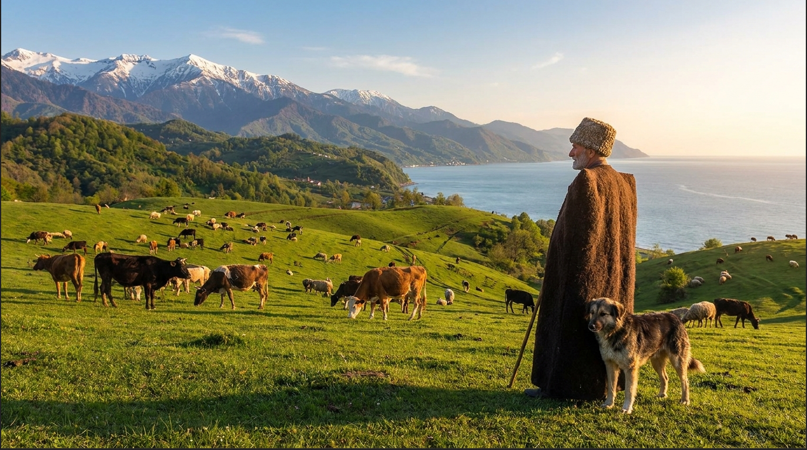
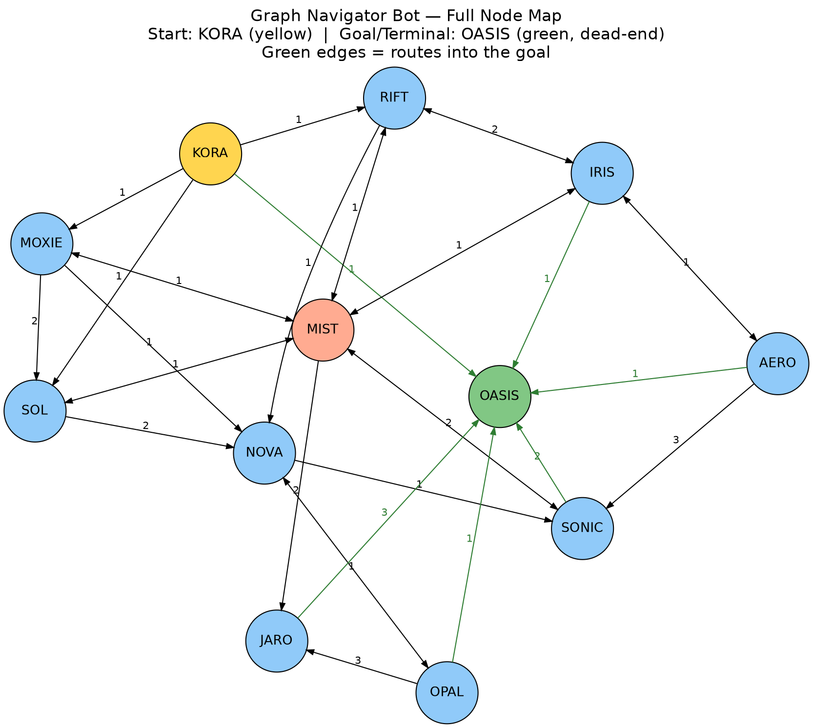

# Introduction to AI — Final Exam
**Nikoloz Lobzhanidze**

---

## Task 1. Using Generative AI

Original picture (`picture-template.jpeg`) edited using **Google Gemini** to add a Caribou (full tool sign-in and editing process documented in Task 2):

---

## Task 2. Creating a User Manual

### User Manual: Adding an AI-Generated Caribou to a Photo Using Gemini

#### Part 1: Signing In to Gemini

Gemini does not have a separate sign-up form. Clicking "Sign in" redirects directly to Google's own sign-in page, since Gemini authenticates through your existing Google account.

1. Navigate to **gemini.google.com** in your browser.
2. Click the **"Sign in"** button in the top-right corner.

3. You are redirected straight to Google's account sign-in page.
4. Enter your email address and password (or select your existing Google account).
5. Once authenticated, you are redirected back to gemini.google.com, signed in and ready to chat.

#### Part 2: Uploading the Photo and Prompting the Edit

1. Click the **+** icon in the chat box to attach a file.
2. Upload the original image (`picture-template.jpeg`).
3. Enter a detailed prompt describing what to add, where to place it, and how to match scale, lighting, and photorealism.

Prompt used:

> Edit this photo by adding one realistic wild caribou standing on the grassy hillside in the left-center foreground, near the grazing cattle, as if it naturally belongs in this herd. Match the caribou's scale to the size of the nearby cows (similar body length/height). Match the exact lighting direction of the scene — warm golden-hour sunlight coming from the right, so the caribou casts a soft shadow extending to its left, consistent with the shadows already visible on the cows and sheep. Match the photo's natural color grading, grain, and sharpness — do not stylize, cartoon-ify, or over-smooth the caribou or the rest of the image. Keep every other element of the original photo (mountains, lake, shepherd, dog, livestock, sky) completely unchanged — only add the caribou. The result should look like an unedited real photograph, not a composite.

4. Submit the prompt and wait for Gemini to generate the edited image.

#### Part 3: Reviewing the Result

- **Before:** shepherd, dog, and cattle grazing on the hillside — no caribou present.
- **After:** a caribou is inserted into the herd on the left side of the frame, matched in scale to the surrounding cattle and consistent with the scene's golden-hour lighting.

**Before / After comparison:**

| Before | After |
|---|---|
|  |  |

---

## Task 3. Finding the Graph

Full traversal of the Graph Navigator Bot, mapping every reachable node and transition. Yellow = start node (KORA). Green = goal node (OASIS), which is a confirmed terminal/dead-end with no outgoing transitions. Green edges lead into the goal. Bidirectional arrows indicate a two-way connection at equal weight; single-direction arrows indicate a one-way transition only.

**12 nodes, 33 directed transitions.** Nodes: KORA, SOL, MOXIE, MIST, RIFT, IRIS, AERO, NOVA, SONIC, JARO, OPAL, OASIS.

---

## Task 4. Build a Web Application

Single-file HTML/CSS/JS GPA calculator, committed under `gpa/index.html`.

- **Subtask 1 (course table):** all 20 real transcript courses (verified against Argus, 98 credits earned — checksum-confirmed) plus 5 additional courses from the Computer Science program, each auto-loaded into a table with course/credit/grade/passed columns.
- **Subtask 2 (program name):** "Computer Science (Major)" displayed on load.
- **Subtask 3 (GPA info):** info icon with hover/click tooltip containing the full English translation of Ilia State University's official GPA calculation rule (`82542.pdf`), including the score→GP conversion table.
- **Subtask 4 (Calculate button):** computes GPA per the official formula — GPA = Σ(GP×credit)/Σ(credit), GP derived per the university's exact banding (flat 1.00 for 51–60, linear 1/12-per-point from 61–95, flat 4.00 for 96–100), rounded to one decimal.
- **Subtask 5 (Calculate with Introduction to AI):** re-runs the same calculation substituting the Intro to AI score with accumulated points (68) + 30 final-exam points = 98, explained on-screen.

Both calculations were independently verified in Python before being written into the app, then re-extracted and re-run in Node against the actual shipped code to confirm no transcription drift: **GPA (as-is) = 2.5**, **GPA (with Intro to AI +30) = 2.6**.
